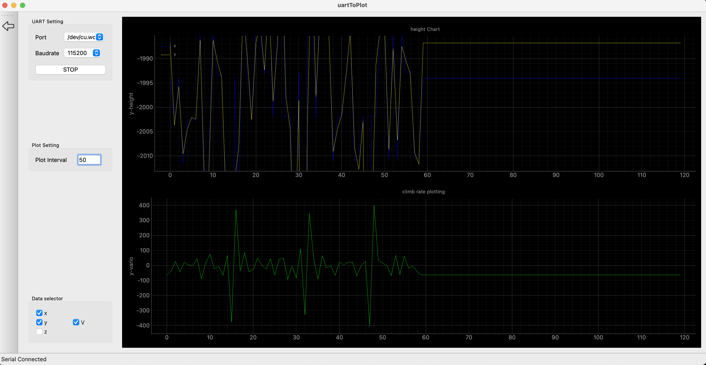

# serial_com_data_plot
read data from serial com, then plot it, using pyside6 &amp; pyqt

### screenshot for mac

### deploment for mac

Install the PyInstaller via pip with the following command:

> pip install pyinstaller

Then package the application with the following command in the root directory:

> pyinstaller --name="SerialPlot" --windowed --icon chicken.icns  main.py

You can find the packaged application in the dist folder.

#### Thanks

[COMTool](https://github.com/neutree/COMTool)

comtool is very useful tool for serial port data reading, but it's graph plugin for mac is not working. That's why I made this tool.