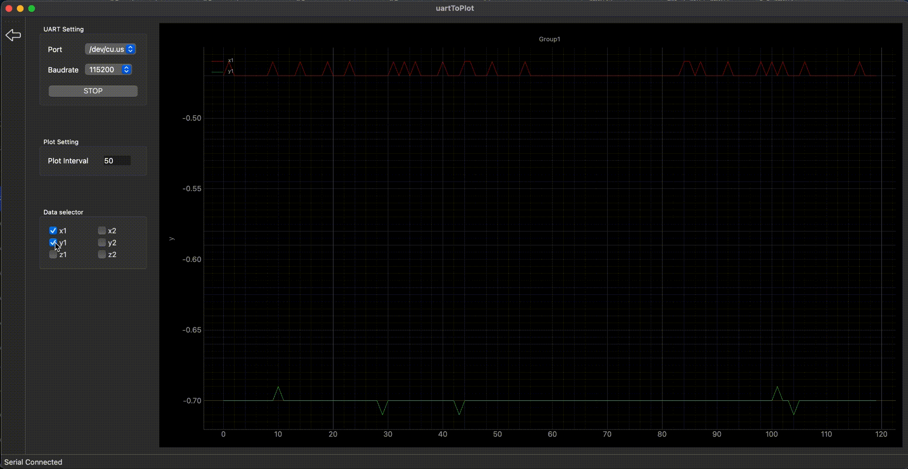

## serial_com_data_plotting_comparator

### 1. Function: 
- continuously reading multiple set of data from serial com,
- plotting them to curve,
- and making camparison.
- with clean UI

### 2. Toolset
- Create UI and interaction functions with pyside6（QT for python）; 
- Plot data with pyQtGraph
- All platform supported: MacOS(tested), Linux, Windows

### 3. How to use

####  3.1 Use case on Mac

<p align = "left">    
select setting:<br>

<br>Full setting:<br>

</p>


#### 3.2 The input data(serial port data stream) format is simple like this:

>```shell 
> $x1:8.25;y1:-7.60;z1:-8.02;x2:-1.76;y2:-2.22;z2:96.77\r\n
> $x1:8.25;y1:-7.60;z1:-8.02;\r\n
>```

### 4. Deploment for mac

#### 4.1 Use PyInstaller
>```shell
> # Install the PyInstaller via pip:
> pip install pyinstaller
>
> # Then package the application with the following command in the root directory:
> pyinstaller --name="Serial Plotter" --windowed --icon resource/icon.icns  main.py
> ```
You can find the packaged application in the dist folder.

#### 4.2 Use pyside6-deploy
It compile pyside6 into diferent modules instead of whole package, so you can reduce the useless ones
pyside6-deploy is along with pyside6, you don't need to install it separately.

>```shell
> pyside6-deploy -c pysidedeploy.spec 
> cd src/deployment/serialPlotter.app/Contents/MacOS
> rm QtPdf QtQml QtQmlModels QtQuick libcrypto.3.dylib QtNetwork
> ```
### 5. Thanks


- [COMTool](https://github.com/neutree/COMTool)

> comtool is very useful tool for serial port data reading, but it's graph plugin for mac is not working. That's why I made this clean tool.

- [Qt for Python](https://doc.qt.io/qtforpython-6/index.html)

- [PyQtGraph](https://pyqtgraph.readthedocs.io/en/latest/)
