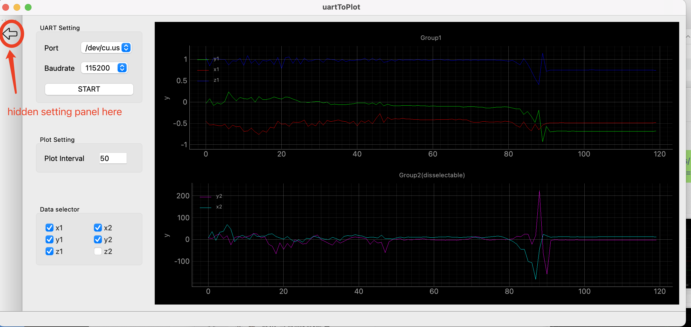
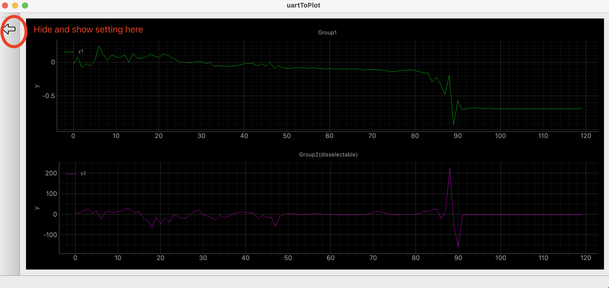
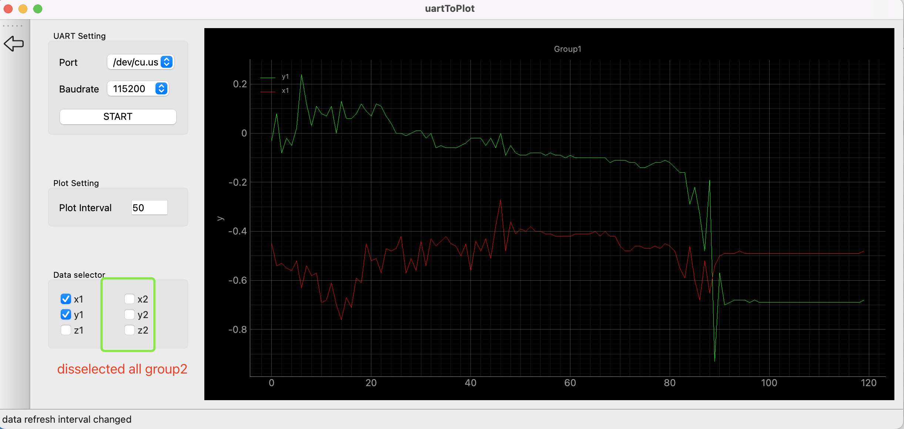

# serial_com_data_plotting_comparator

### Function: 
> - continuously reading multiple set of data from serial com,
> - plotting them to curve,
> - and making camparison.
> - with clean UI

### Tool
- Create UI and interaction functions with pyside6（QT for python）; 
- Plot data with pyQtGraph
- All platform supported: MacOS(tested), Linux, Windows

# How to use

##  Use case on Mac
show setting:


Hide setting


diselect all the item from group2


=======

## The input data(serial port data stream) format is simple like this:

>```shell 
> // group 1(must)
> $x1:-3257.31
> $y1:-3257.14
> $z1:-3257.14
> // group 2(option)
> $x2:-3257.31
> $y2:-3257.14
> $z2:-3257.14
>```

## Deploment for mac

Install the PyInstaller via pip with the following command:
>```shell
> pip install pyinstaller
> ```


Then package the application with the following command in the root directory:
> ```shell
> pyinstaller --name="Serial Plotter" --windowed --icon resource/icon.icns  main.py
> ```
You can find the packaged application in the dist folder.

# Thanks


[COMTool](https://github.com/neutree/COMTool)

comtool is very useful tool for serial port data reading, but it's graph plugin for mac is not working. That's why I made this clean tool.

[Qt for Python](https://doc.qt.io/qtforpython-6/index.html)
[PyQtGraph](https://pyqtgraph.readthedocs.io/en/latest/)
