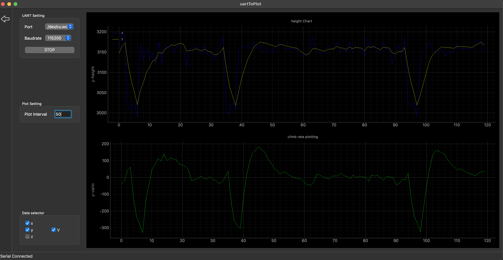
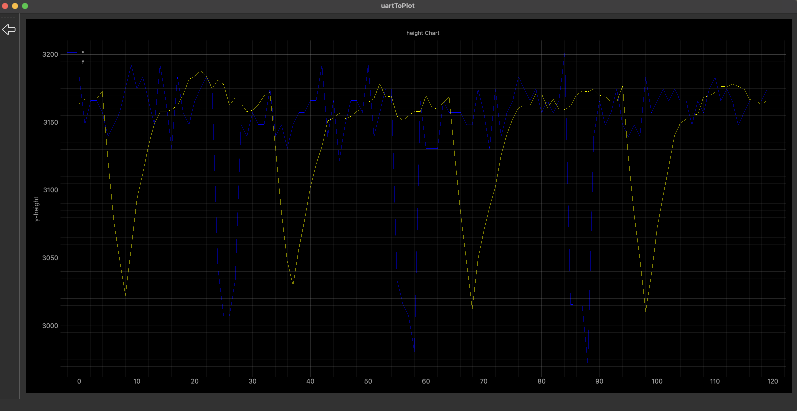

# serial_com_data_plot

function: read data from serial com, then plot it
- create UI and function with pyside6; 
- plot data with pyQtGraph 

# How to use


##  Use case on Mac
show setting the UI:

Hide setting and diselect the v data the UI


## The input data(serial port data stream) format is simple like this:

>```shell
> $x:-3257.31
> $y:-3257.14
> $z:-3078.99
> $v:-3.62
>```

## Deploment for mac

Install the PyInstaller via pip with the following command:
>```shell
> pip install pyinstaller
> ```


Then package the application with the following command in the root directory:
> ```shell
> pyinstaller --name="Serial Plotter" --windowed --icon resource/icon.icns  main.py
> ```
You can find the packaged application in the dist folder.

# Thanks


[COMTool](https://github.com/neutree/COMTool)

comtool is very useful tool for serial port data reading, but it's graph plugin for mac is not working. That's why I made this clean tool.